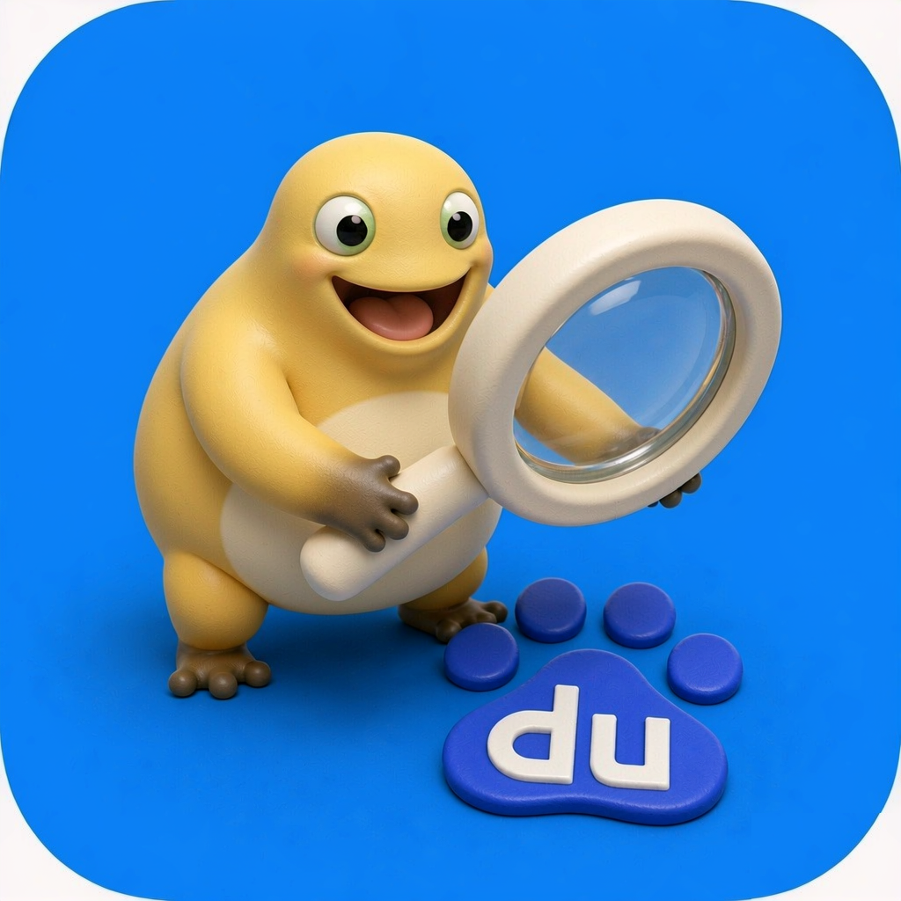
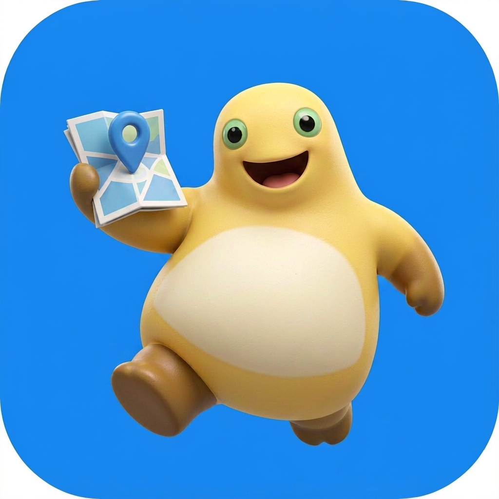

# naiwa-icons · 奶蛙图标素材库

  
  
  
  

自制「奶蛙」风格安卓图标套的素材归档：每枚图标 = 品牌色圆角方背板 + 3D 黏土质感奶蛙与 App 核心元素互动。

> **English** · 67 hand-drawn Android app icons (1024×1024 PNG, RGB) in a soft 3D clay style, with the full design spec and reusable prompt template. Licensed CC BY-NC-SA 4.0. Want them on your phone? Grab the app: [chromoany/naiwa-icons-app](https://github.com/chromoany/naiwa-icons-app).

> **想装到手机上用？** → [chromoany/naiwa-icons-app](https://github.com/chromoany/naiwa-icons-app)：下载 APK，附各品牌手机换图标步骤。

## 内容

- `final-icons-1024/` —— 已定稿成品图（PNG，1024×1024，RGB）
- `refs/` —— 奶蛙官方形象参考图（生成时的基准图，见 [ICONS.md](ICONS.md) 贡献指南）
- `ICONS.md` —— **图标清单与设计规范**：风格硬约束、可复制的提示词模板、返工决策与贡献新图标的完整流程

## 已完成图标（67 枚）

按**应用名首字母**排序（中文名按拼音、英文名按字母本身）。每格上图为 1024×1024 成品（此处缩略至 96×96），下为应用名与资源名。完整规范与贡献指南见 [ICONS.md](ICONS.md)。

<table>
  <tr>
    <td align="center"> <b>爱奇艺</b> <code>iqiyi</code></td>
    <td align="center"> <b>阿里云盘</b> <code>aliyundrive</code></td>
    <td align="center"> <b>百度</b> <code>baidu</code></td>
    <td align="center"> <b>百词斩</b> <code>baicizhan</code></td>
    <td align="center"> <b>百度地图</b> <code>baidu_map</code></td>
    <td align="center"> <b>百度贴吧</b> <code>tieba</code></td>
  </tr>
  <tr>
    <td align="center"> <b>百度网盘</b> <code>baidu_netdisk</code></td>
    <td align="center"> <b>备忘录</b> <code>notes</code></td>
    <td align="center"> <b>哔哩哔哩</b> <code>bilibili</code></td>
    <td align="center"> <b>ChatGPT</b> <code>chatgpt</code></td>
    <td align="center"> <b>Chrome</b> <code>chrome</code></td>
    <td align="center"> <b>DeepSeek</b> <code>deepseek</code></td>
  </tr>
  <tr>
    <td align="center"> <b>电话</b> <code>phone</code></td>
    <td align="center"> <b>电话本</b> <code>contacts</code></td>
    <td align="center"> <b>滴滴出行</b> <code>didi</code></td>
    <td align="center"> <b>Discord</b> <code>discord</code></td>
    <td align="center"> <b>懂车帝</b> <code>dongchedi</code></td>
    <td align="center"> <b>豆包</b> <code>doubao</code></td>
  </tr>
  <tr>
    <td align="center"> <b>抖音</b> <code>douyin</code></td>
    <td align="center"> <b>抖音商城</b> <code>douyin_mall</code></td>
    <td align="center"> <b>飞书</b> <code>feishu</code></td>
    <td align="center"> <b>高德地图</b> <code>amap</code></td>
    <td align="center"> <b>GitHub</b> <code>github</code></td>
    <td align="center"> <b>剪映</b> <code>jianying</code></td>
  </tr>
  <tr>
    <td align="center"> <b>京东</b> <code>jd</code></td>
    <td align="center"> <b>计算器</b> <code>calculator</code></td>
    <td align="center"> <b>Keep</b> <code>keep</code></td>
    <td align="center"> <b>快手</b> <code>kuaishou</code></td>
    <td align="center"> <b>录音机</b> <code>recorder</code></td>
    <td align="center"> <b>美团</b> <code>meituan</code></td>
  </tr>
  <tr>
    <td align="center"> <b>咪咕视频</b> <code>migu_video</code></td>
    <td align="center"> <b>明日方舟</b> <code>arknights</code></td>
    <td align="center"> <b>明日方舟：终末地</b> <code>endfield</code></td>
    <td align="center"> <b>拼多多</b> <code>pinduoduo</code></td>
    <td align="center"> <b>Play 商店</b> <code>play_store</code></td>
    <td align="center"> <b>企业微信</b> <code>wecom</code></td>
  </tr>
  <tr>
    <td align="center"> <b>QQ</b> <code>qq</code></td>
    <td align="center"> <b>日历</b> <code>calendar</code></td>
    <td align="center"> <b>软件商店</b> <code>software_store</code></td>
    <td align="center"> <b>设置</b> <code>settings</code></td>
    <td align="center"> <b>时钟</b> <code>clock</code></td>
    <td align="center"> <b>Signal</b> <code>signal</code></td>
  </tr>
  <tr>
    <td align="center"> <b>淘宝</b> <code>taobao</code></td>
    <td align="center"> <b>Telegram</b> <code>telegram</code></td>
    <td align="center"> <b>天气</b> <code>weather</code></td>
    <td align="center"> <b>铁路12306</b> <code>railway</code></td>
    <td align="center"> <b>TIM</b> <code>tim</code></td>
    <td align="center"> <b>网易云音乐</b> <code>netease</code></td>
  </tr>
  <tr>
    <td align="center"> <b>王者荣耀</b> <code>wzry</code></td>
    <td align="center"> <b>微博</b> <code>weibo</code></td>
    <td align="center"> <b>微信</b> <code>wechat</code></td>
    <td align="center"> <b>我的文件</b> <code>files</code></td>
    <td align="center"> <b>WPS Office</b> <code>wps</code></td>
    <td align="center"> <b>相册</b> <code>gallery</code></td>
  </tr>
  <tr>
    <td align="center"> <b>相机</b> <code>camera</code></td>
    <td align="center"> <b>小红书</b> <code>xiaohongshu</code></td>
    <td align="center"> <b>携程</b> <code>ctrip</code></td>
    <td align="center"> <b>信息</b> <code>messages</code></td>
    <td align="center"> <b>系统浏览器</b> <code>samsung_internet</code></td>
    <td align="center"> <b>学习通</b> <code>xuexitong</code></td>
  </tr>
  <tr>
    <td align="center"> <b>应用商店</b> <code>galaxy_store</code></td>
    <td align="center"> <b>邮件</b> <code>email</code></td>
    <td align="center"> <b>优酷</b> <code>youku</code></td>
    <td align="center"> <b>支付宝</b> <code>alipay</code></td>
    <td align="center"> <b>知乎</b> <code>zhihu</code></td>
    <td align="center"> <b>指南针</b> <code>compass</code></td>
  </tr>
  <tr>
    <td align="center"> <b>作业帮</b> <code>zuoyebang</code></td>
    <td></td>
    <td></td>
    <td></td>
    <td></td>
    <td></td>
  </tr>
</table>

## 设计规范速览

| 项目 | 数值 |
|---|---|
| 成品图 | 1024×1024 PNG（RGB，无 Alpha） |
| 画面 | App 品牌主色圆角方背板，奶蛙居中占 60–75%，App 元素 3D 化占 25–40% |
| 渲染 | 3D 黏土/软陶质感，柔光棚拍光，禁 2D 扁平 |
| 命名 | `^[a-z][a-z0-9_]*$` |

完整硬约束（形象比例、四肢配色、构图叙事等）见 [ICONS.md](ICONS.md)。

## 许可证

本仓库的图标美术作品与文档采用 [CC BY-NC-SA 4.0](LICENSE)（署名 — 非商业性使用 — 相同方式共享 4.0 国际）。

可以自由使用、修改、分享给朋友；**需要署名、禁止商用、衍生作品需使用同一协议**。想拿去做付费产品或上架商店，请先联系作者。

## 相关仓库

- [chromoany/naiwa-icons-app](https://github.com/chromoany/naiwa-icons-app) —— 图标包 App 的发布仓库：下载 APK、安装说明、各品牌手机怎么换图标
